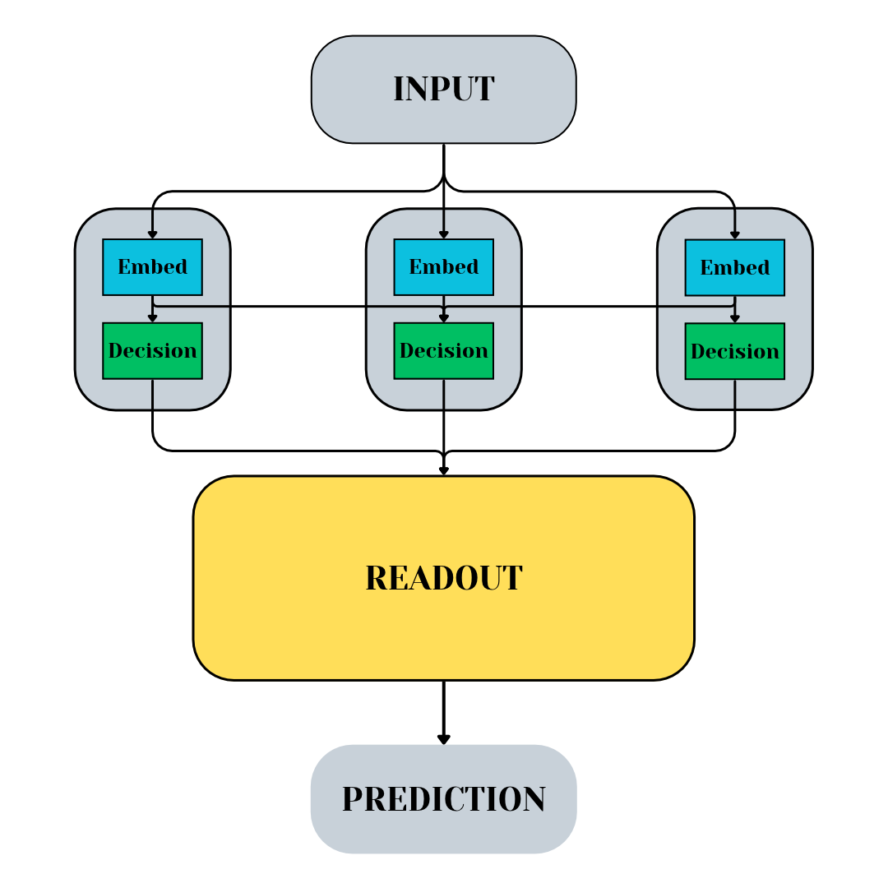

# Symlearn

The *symlearn* package functions as an implementation of "symbiotic learning": a paradigm for simultaneously training multiple machine-learning models at once, in which collaboration between models is **intrinsic** and **incentivized**. The goal for this method is to effectively leverage the collaboration of relatively small models to achieve performance comparable to that of large, computationally expensive models. 

A key feature of this method is a minimally-sized attention block (termed the Readout) whose task is to aggregate the perspectives and decisions of the symbiotically trained upstream (pre-Readout) models, giving a final prediction. The appending of this block to the overall system occurs after a pre-determined number of training epochs, this event being termed *uplift*. As such, the framework is separated into two phases: pre-uplift and post-uplift.

A system of symbiotically trained ML models with a Readout block is termed a *Symbiotic Uplift Network*.

---

## Training
$N$ pre-Readout models are initialized for the primary task, each having an "embedding block" and an "output block": 

- The exact architecture of the embedding block is task-dependent; for an image-classification task, for example, the embedding block could consist of convolutional layers. 

- The only requirement of the output block is that it must receive the concatenation of all $N$ embeddings as input to yield a task-specific prediction.

### Pre-Uplift
1. Each pre-Readout model performs its initial assessment of the input data using its embedding block.
2. The $N$ embeddings are concatenated and used as input to each of the models' output blocks, resulting in $N$ predictions.
3. A pre-Readout model's total (symbiotic) loss is calculated using its own output as well as the outputs of its peers, with an additional term calculated from their initial embeddings to encourage diversity of perspectives. The weighting of each of these terms is determined by that model's *collaboration parameter*.

### Post-Uplift
1. Each pre-Readout model performs its initial assessment of the input data using its embedding block.
2. The $N$ embeddings are concatenated and used as input to each of the models' output blocks, resulting in $N$ predictions.
3. The $N$ predictions are concatenated and passed to the Readout's attention layer. Additonally, the vector of pre-Readout embeddings is passed through a single fully-connected layer and concatenated with the attention layer's output. This vector is then passed through fully-connected layers, resulting in the final prediction.
4. The Readout is then penalized on how strong its own prediction was compared to the strength of the pre-Readout predictions via a non-linearity.
5. Each pre-Readout model's symbiotic loss then has a term added to it capturing that model's culpability for the Readout's mistakes. This term is called the model's "blame loss" and is scaled using a global hyperparameter (termed "responsibility").

---

## Definitions
- Symbiotic Uplift Network: An aggregate network of machine-learning models trained using symbiotic learning.
- Symbiotic Loss ($L_{sym,i}$): A pre-Readout model's multi-objective loss function. Collaboration parameters enable coupling of models' loss functions such that 1) an individual model's parameters will also be updated based on the other models' personal losses, and 2) diversity of perspective is encouraged via Embedding Loss. 

$$ L_{sym,i} = (1-\alpha_i)L_i + \alpha_i(\sum_{j \neq i}{L_j}) + \alpha_{i}^{2}L_{embed,i} $$

 (Note: The only learnable parameters affected by this coupling are those used in the initial embedding blocks.)
 
- Collaboration Parameters ($\alpha_i$): Coupling constants (hyperparameters) in the symbiotic loss functions of pre-Readout models. Must be in the range $[0,1]$.
- Personal Loss ($L_i$): A term in a pre-Readout model's symbiotic loss computed using only that model's prediction. Task-specific.
- Embedding Loss ($L_{embed,i}$): A contrastive term in a pre-Readout model's symbiotic loss which encourages diverse initial assessments. *EmbedSim* is defined to be the cosine similarity function scaled to the range $[0,1]$, and $\delta$ is a temperature hyperparameter shared between all pre-Readout models.
  
$$ L_{embed,i} = \frac{1}{N-1}\sum_{j \neq i}[\exp{(EmbedSim(x_i, x_j)/\delta)-1}] $$

- Blame Loss ($L_{blame, i}$): A term added to a pre-Readout model's symbiotic loss after uplift, capturing that model's contribution to the Readout's loss. $\lambda$ is termed a "responsibility" hyperparameter shared between all pre-Readout models

$$ L_{blame, i} = \lambda(\frac{L_i}{\sum L_i})*L_F $$

- Readout Loss ($L_{Readout}$): A loss function specific to the Readout block which penalizes it the lower the sum of pre-Readout personal losses is, where $L_F$ is its personal loss, and $\tau$ is a temperature hyperparameter.

$$ L_{Readout} = L_F (1+\exp[-\tau(\sum L_i)]) $$

## Symbiotic Uplift Network Architecture

## Readout Architecture

